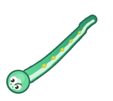
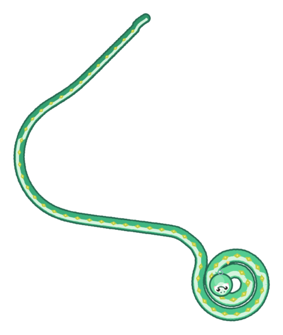
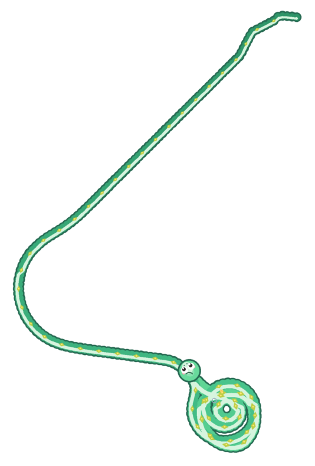
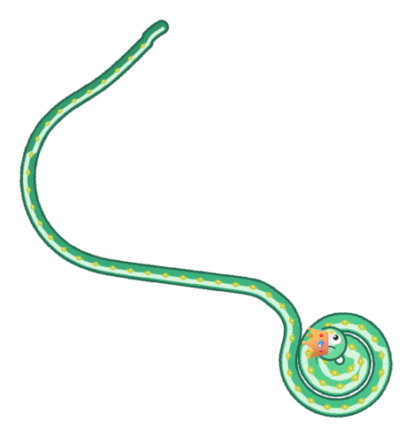
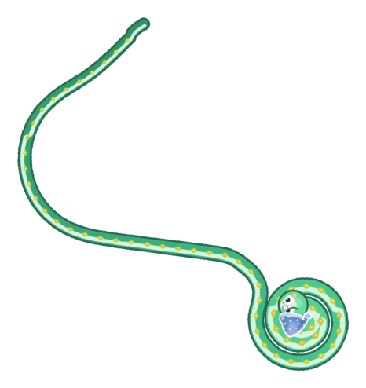
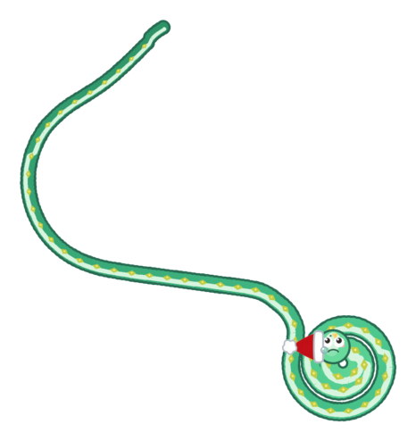
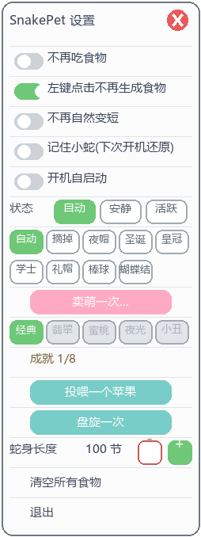

# SnakePet v5.2.2 🐍

> ## ⚠️ AI 生成项目 · 仅供学习与测试
>
> - **本项目的全部代码、调试与验收证据均由 AI 智能体生成**（WorkBuddy / DeepSeek-V4.1-Flash 在本机完成编码、验证与合并），不是人工逐行编写的作品。
> - **用途仅限学习、研究与测试**：请勿用于生产环境、商业用途，或直接照搬其中的 Win32 技巧到对稳定性有要求的场景。
> - **运行前请知悉它的行为**：会创建**桌面最底层的透明分层窗口**、读取全局鼠标钩子；可选写入 `HKCU\...\CurrentVersion\Run`（开机自启）；并在**本目录**读写 `pet_state.json` / `snake_pet_config.json` 作为存档（`autosave` 每 60 秒一次）。
> - 代码与配套的验收证据、已知问题都如实保留在仓库里，适合作为「AI 参与中型项目开发 + 严格验收流程」的观察样本。

**Windows 桌面宠物小蛇** —— 一条住在桌面最底层、会陪你上班摸鱼的贪吃蛇。

360° 自由游动 · 分层盘旋 · 帽子衣柜 · 皮肤养成 · 抚摸拎起 · 自动存档

| 游动 | 分层盘旋 | 100 节长蛇 |
|---|---|---|
|  |  |  |

| 皇冠（512px 贴图） | 夜帽 | 圣诞帽 |
|---|---|---|
|  |  |  |

> 以上预览全部是当前版本的**确定性渲染探针输出**（`python run_pet.py --render-probe DIR`），不是示意图 —— 你双击启动后看到的就是这个样子。

纯 **Win32 分层窗口 + Pillow** 实现，无 tkinter / pygame / 游戏引擎依赖，单进程轻量运行，开箱即用。

---

## 🆕 v5.2.2 修复了什么（2026-09-21）

| 反馈 | 根因 | 现在 |
|---|---|---|
| 我在别的软件里（例如全屏的开发窗口）右键，界面里根本没有蛇，可只要位置**刚好和蛇在桌面上的位置重合**，蛇的菜单就弹出来妨碍我 | 右键分支**只做坐标命中判定**（命中半径 40px），从不校验"这个屏幕位置上最顶层的是谁"；而同一函数的左键分支**有**归属校验 —— 一处明显的不对称。于是别的窗口盖住桌面时，右键照样隔空命中（那时蛇其实被盖着、你根本看不见它） | 新增 `_point_is_desktop()` 归属判据：**只有该位置上蛇真的可见**（最顶层是桌面系或蛇自己）才响应鼠标。右键不弹、左键也不互动；桌面上照常 |
| 顺带 | `_is_desktop_at()` 里有一条 `_hit_snake(x, y) → True` 的**自命中短路**，等于把归属校验整个绕过（且坐标口径与 `seg_pos` 不一致，是死代码） | 删除该短路，坐标口径统一 |

> 实测关键结论：本机 `WindowFromPoint` **不参与分层窗口的 alpha 命中测试** ——
> 即便把蛇 `HWND_TOPMOST` 置顶，`window_from_point(蛇头)` 依然返回桌面图标层 `SysListView32`
> 而不是蛇自己。所以判据只能写成"最顶层是不是**桌面系**"，不能写成"是不是自己"。
> 单测 **106 → 124 例**（新增 `tests/test_menu_rclick.py`，未修改任何既有断言）。

## 🆕 v5.2.1 修复了什么（2026-09-21）

| 反馈 | 根因 | 现在 |
|---|---|---|
| 「不再吃食物」是关的，蛇却怎么也不来吃 | **安静档**在代码里把 `active` 压成 False，而进食判定挂在 `active` 上 → 安静档连碰到食物都不吃（v4 原始设计）；食物吃不到 → 饱食度掉到 0 → 一直在"盘旋→打呼噜→冷却"循环 | 安静档改为**慢速档**：照样去吃，只是保持安静步速；**吃不吃只由「不再吃食物」开关决定** |
| 蛇有时出现在微信等非桌面窗口之上 | ① 看门狗用 `WindowFromPoint` 判断"是否被遮挡"，而本机该函数**恒返回桌面图标层** → 永远判"被遮挡" → **每 60 秒重建一次窗口**（历史日志 663 次 / 0 次）；② 重建后调用 `HWND_NOTOPMOST`，其语义是"置于所有非置顶窗口之上" → 把蛇钉在最上层。另外 `SWP_FLAGS` 误含 `SWP_NOZORDER`，让"沉底"一直是空操作 | 桌面系窗口不算遮挡；被遮挡/画面不新鲜**只重推画面、不重建窗口**；重建后把窗口放到**当前前台窗口正下方**；`SWP_FLAGS` 修正为 `NOMOVE\|NOSIZE\|NOACTIVATE` |
| 顺带修好 | 句柄重建失败时看门狗会**永久自禁用**（蛇再也不出现）；像素陈旧判定因长期不可达而从未生效 | 句柄丢失按 5 秒节流重试；像素判定改为"重推画面"且不影响 z 序 |

> 两条根因都是**长期存在**的（BUG-A 来自 v4 原始设计 `cf71fe7`），不是最近改动引入的。
> 单测 **87 → 106 例**（两个新回归文件，未修改任何既有断言）。

## 🆕 v5.2.0 升级了什么（2026-09-20）

### 1. 体验改进（用户逐条反馈驱动）

| 反馈 | 现在的行为 |
|---|---|
| 睡觉前应该先盘旋，不能跑着跑着直接"打呼噜" | 饱食度归零后进入**盘旋准备**：先盘一次（最多尝试 5 次，间隔 1.2s），盘不起来才降级为直接入睡 |
| 睡觉太频繁、时长不合理 | 打呼噜 **6~12 秒随机**（从**盘旋结束**那一刻开始计时）；醒来后有 **5~8 分钟冷却**，冷却内不会再想睡 |
| 解锁皮肤要喂太多 | 解锁门槛 `(0, 10, 30, 60, 100)` → **`(0, 3, 8, 15, 25)`** |
| 想让"经典"是默认、"翡翠"要解锁 | 「经典绿」改为**默认皮肤**、「翡翠玉蛇」改为**需解锁**（按用户要求只互换显示名，两套配色与顺序不动，按下按钮看到的颜色与改动前一致） |
| 不喂食就自然变短 | 新增开关 **「不再自然变短」**（默认关闭 = 保持原行为，不偷偷改变老用户体验） |

### 2. 缺陷修复（含两个"根因级"的老问题）

- **分层盘旋在部分机器上 100% 失效（根因级）** —— Windows 11 的手写墨迹输入层 `ShellHandwritingCanvas` 是「**全屏 + 置顶 + 分层**」窗口，被避让逻辑当成障碍物、外扩 240px 后覆盖了整个工作区，于是 `make_coil_plan()` 恒返回 `None`。**v5 招牌的分层盘旋在这些机器上从未生效过**。实测修复前可用盘旋中心 `0/2240`，修复后起盘 `5/5`。
  > 这条是「自动探针永远抓不到」的典型：探针是 headless，避让逻辑首行就 return —— 只有真机验收能发现。
- **拖拽时身体断层** —— 渲染采样器处理「目标弧长越过当前段」时用的是**绝对容差**（按安静档步距 1.6px 标定），而拎起路径的段长是 30px → 采样点被"吸附"回原始折点，相邻绘制点距退化为 30~35px（超过身直径 20px）→ 肉眼断层。改为「前进到真正包含该弧长的那一段再插值」，四种拖拽模式一律 8.00px。
- **拖拽后帽子/尾巴被裁掉** —— 合成窗口的包围盒里帽子只贡献两个**硬编码在头顶上方**的点，而帽子是**随朝向整圈公转**的（朝向 180~225° 时它挂到头下方）→ 底部溢出 23.8px，绒球整块丢失。改为使用旋转后贴图在**世界坐标下的真实落点矩形**，并让包围盒与绘制**共用同一份采样点**。
- **菜单「退出」键消失**（上一版引入的回归）—— 面板高度公式里硬编码着「开关×4」，新增第 5 个开关后没同步 → 少算一行 38px，最后一行被画出画布、被圆角边框压住。已把开关组提成唯一真源，并让渲染高度以**布局实测值**为准。
- **头饰歪戴 / 皇冠偏小** —— 圣诞帽、夜帽的 `base_offset_deg`（30 / 35）是**无依据的额外旋转**（两张画稿本身就是正立的）→ 帽沿斜切过脸、后脑空着；皇冠 `scale=0.82` 是 7 顶里最小的、佩戴点也偏低。另外 `load_registry()` 用整条替换合并，导致 `hats.json` 未写的 `pivot` 字段把**逐顶标定好的佩戴线整条丢掉** —— 原作者校准过的佩戴线从未生效。
- **拖拽每帧限速失效** —— `DRAG_MAX_STEP` 的本意是"每帧位移上限"，但每来一个鼠标 MOVE 事件就会调用一次，高回报率鼠标一帧能塞进几十个事件 → 实测一帧可跳 423px，身体被拉成横跨数百像素的直线。

### 3. 性能与画质（另一条并行工作线贡献，已合并入主干）

- **帧率 45 → 62.5fps**（`TICK_MS` 22 → 16ms）。做法是把常量表内**所有「每帧」量等比 ×16/22**（步速、每帧转角、各种帧计数周期、特效帧寿命），因此**真实时间速度、转弯半径、秒级节奏完全不变**，35 例既有单测的帧计数断言一条没动。
- **去马赛克**：超采样像素预算下限 40 万 → **70 万**、上限 2× → **3×**。根因是长蛇大画布时 `sqrt(预算/面积)` 被钳到 1.0 → **零抗锯齿**；现在中大画布保底 ≥1.05×，预算仍按实测帧耗时自适应升降，慢机器自动回落保帧率。
- **帽子贴图 128px → 512px 超分**（realesrgan 两遍法，保留 RGBA 通道），戴在头上明显更锐利。

### 4. 工程化与验收

- 单测 **64 → 87 例**，新增的都是**不变量回归测试**：菜单布局必须装得下所有行（7 例）、渲染采样器的相邻点距必须等于步长（10 例）、`hats.json` 与代码内默认表必须逐字段一致（6 例）。
- 两个并行分支（体验修复线 / 帧率画质线）合并入 `master`，合并后做了**逐文件哈希核验**（两侧改动无一丢失）+ **渲染探针 20 场景与合并前逐像素完全一致**（0 差异）。
- 配套证据全部留档在 `reports/`：确定性渲染探针、浸泡测试 JSON、修复前后对照图。

## ✨ 它能做什么

- **住在桌面上**：小蛇沉底显示，打开任何软件都会盖住它，回到桌面就能看到；透明区域不挡鼠标点击。
- **自由游动**：360° 连续转向（v4 只会四方向"拐直角"），转弯半径 ~100px 的大弧线，路径经滑动平滑，游动丝滑无抖动。
- **会饿会吃**：在桌面空白处左键点一下，那里长出一颗苹果，小蛇自己摇摆着爬过去吃掉，身体变长、心情变好。
- **分层盘旋**：空闲时（或菜单里点「盘旋一次」）小蛇沿阿基米德螺线盘入 → 盘踞 → 盘出，身体绕成多层同心圈；**入睡前也会先盘一次**。
- **帽子衣柜**：夜帽 / 圣诞帽 / 皇冠 / 学士帽 / 礼帽 / 棒球帽 / 蝴蝶结共 7 顶，贴图 512px 宽、全部**随头朝向旋转**；`自动` 档在夜里(22:00–6:00)自动戴上睡帽。
- **心情与表情**：开心 / 平常 / 饿了 / 睡觉四种状态，眨眼、吐信、腮红、说话气泡、Z 字弹幕……
- **养成系统**：吃多了会消化回收、长大变身、短期猛吃会变圆润；5 套皮肤与 8 个成就靠投喂解锁（门槛 3 / 8 / 15 / 25 颗）；**重启电脑后小蛇还记得你**（位置 / 长度 / 皮肤 / 帽子 / 成就全部保留）。
- **自我修复**：窗口被长时间遮挡后自动重推画面（不重建窗口），挂机数天也不怕"消失"；句柄异常时按节流重试重建。

## 🎮 交互指南

| 你做什么 | 小蛇的反应 |
|---|---|
| 桌面空白处 **左键点击** | 长出一颗苹果（打开软件时点击不生成，不会误触） |
| **按住蛇头** 0.3 秒不动 | 抚摸：爱心满天飞（冷却 2 秒） |
| **按住蛇头拖动** | 拎起小蛇搬到任何地方，松手放下（睡觉中会被拎醒） |
| **双击蛇身** | 跳跃 + 说话气泡 |
| **右键蛇身** | 打开设置菜单 |

> **所有鼠标交互都要求「蛇此刻真的在这个位置上、你看得见它」**（v5.2.2 起）。
> 当别的窗口盖住桌面时，你在那个窗口里点/右键，即使屏幕坐标与蛇重合也**不会**触发
> —— 不会隔空长出苹果、不会冒出气泡、更不会弹出设置菜单打断你的工作。

## ⚙️ 右键菜单

| 分组 | 内容 |
|---|---|
| 开关 | 不再吃食物 / 左键点击不再生成食物 / **不再自然变短** / **记住小蛇(下次开机还原)** / 开机自启动 |
| 状态 | 自动（有食物才活跃）· 安静（**慢速档**）· 活跃 —— 三档都**会去吃**食物，吃不吃只由「不再吃食物」决定 |
| 帽子 | 自动 · 摘掉 · 7 顶帽子任选 |
| 皮肤 | **经典绿(默认)** · 翡翠玉蛇(吃 3 颗解锁) · 蜜桃粉(8) · 夜光(15) · 小丑(25) |
| 趣味 | 卖萌一次 · 投喂一个苹果 · 盘旋一次 |
| 长度 | −/＋ 微调；**点击节数数字**弹出数字键盘直接输入（2~100 节） |
| 其他 | 成就进度 (n/8) · 清空所有食物 · 退出 |




## 🍜 养成机制

- 每颗苹果：体长 +20px，饱食度 +20；饱食度随时间缓慢下降（0.1/秒）。
- **消化**：饱食度低于 40 时，身体慢慢缩回当前阶段的基础长度，伴着消化泡泡；菜单里可一键关闭（「不再自然变短」）。
- **睡觉**：饱食度归零 → **先盘旋**（最多试 5 次）→ 打呼噜 **6~12 秒** → 醒来回一点饱食度，并进入 **5~8 分钟**的"不想睡"冷却。睡觉中拎起会把它唤醒。
- **成长**：累计进食 20 颗长大成蛇（体型 ×1.15），100 颗成为大蛇（×1.3），帽子也跟着变大。
- **胖瘦**：10 分钟内连续进食会变圆润，一段时间不吃就恢复身材。
- **成就 8 枚**：初来乍到 / 第一口 / 小吃货 / 干饭王 / 传奇 / 七日之约 / 转圈圈 / 摸头杀。
- **存档**：退出、每 60 秒、以及成就解锁等关键时刻自动保存；档案损坏自动备份重建；菜单里可一键关闭"记住小蛇"。

## 🚀 快速开始

1. 安装 [Python 3.10+](https://www.python.org/downloads/)（安装时勾选 *Add to PATH*）。
2. 克隆本仓库，**双击 `启动小蛇.bat`**（首次运行自动安装 Pillow）。
3. 完成，小蛇已经在桌面等你了。

```bat
启动小蛇.bat
```

### 命令行

```bat
python run_pet.py                        正常启动
python run_pet.py --selftest             自检（运动学断言 + 模块自检）
python run_pet.py --soak 300             300 秒无人值守浸泡测试，输出 JSON 报告
python run_pet.py --soak 300 --headless  无窗口模式（CI / 远程会话）
python run_pet.py --render-probe DIR     渲染 20 张代表性画面到目录，用于视觉验收
```

> `--soak` / `--render-probe` 会用独立存档目录，不碰你的真实存档。
> 手工调用这两个入口时**必须同时设** `SNAKEPET_HOME`（隔离目录）与 `SNAKEPET_TOOL_HOME=1`，
> 否则程序的隔离逻辑会把 home 再嵌套一层、导致贴图加载不到（详见 `snake_pet/__main__.py` 的 `_isolate_tool_home`）。

## 📁 项目结构

```
├── 启动小蛇.bat        双击启动（自动检查 Python / Pillow）
├── run_pet.py          启动入口
├── snake_pet/          源码包（15 个模块 / 约 4,500 行）
│   ├── constants.py    全部数值与主题表（调参入口）
│   ├── config.py       用户配置 + 版本迁移链
│   ├── platform_win.py Win32 封装（分层窗口/钩子/互斥/注册表）
│   ├── sprites.py      贴图加载与配色提取
│   ├── snake.py        360° 运动学（转向器/闲逛/追食/盘旋计划）
│   ├── behavior.py     状态机（饱食度/心情/睡觉三阶段/盘旋触发）
│   ├── interact.py     互动状态机（抚摸/拎起，纯逻辑可单测）
│   ├── growth.py       养成数值（消化/阶段/胖瘦/成就/存档）
│   ├── hats.py         帽子衣柜（佩戴线锚定/兜底手绘）
│   ├── render.py       PIL 渲染管线（多层绘制 + 路径平滑 + 合成包围盒）
│   ├── menu.py         右键菜单（开关组唯一真源/长度输入编辑器）
│   └── app.py          组装：窗口/钩子/主循环/看门狗
├── sprites/hats/       帽子贴图（512px 宽）+ hats.json 锚点元数据
├── tests/              pytest 单测（87 例，全部离屏可跑）
├── reports/            各阶段验收证据（浸泡 JSON / 渲染探针 / 对照图 / 核验记录）
└── dist/delivery/      交付文档快照（使用说明 / CHANGELOG / 素材致谢）
```

## 🏗️ 技术实现要点

想改造或二开的话，这些是核心设计：

- **渲染管线**：每帧用 Pillow 把"蛇 + 食物 + 特效"画成整幅 RGBA，经 `UpdateLayeredWindow` 推上分层窗口，透明区天然点击穿透；**像素预算自适应超采样**（渲染像素数恒定 ≤ 预算，按实测帧耗时自动升降），小画布最高 3× 抗锯齿、大画布自动降档（超采样下限 70 万像素，长蛇大画布不再退化为零抗锯齿），目标帧率 62.5fps。
- **合成窗口包围盒**：窗口尺寸由「头部 + 食物 + 特效 + **旋转后帽子的真实落点矩形** + **实际绘制的那份身体采样点**」共同决定 —— 这两处都踩过坑：帽子的包围盒不能假定"在头顶"，身体包围盒不能使用原始轨迹点（绘制用的是平滑后轨迹）。
- **360° 运动学**：蛇头持有朝向角 θ，每帧经限速转向器逼近目标方向；闲逛 = 高斯漂移 + 趋势角重置 + 边界内推场 + 障碍扇形采样；身体沿轨迹按弧长采样，天然支持任意弯曲。
- **丝滑曲线**：转向死区 + 渲染路径滑窗平均，小碎弯被圆弧化；腹带/描线用带 `joint` 的连续笔画。
- **弧长采样器（v5.2 重写）**：越界处理不使用绝对容差，而是「前进到真正包含目标弧长的那一段再插值」，因此**与段长无关** —— 安静档 1.6px 与拎起档 30px 得到同样均匀的点距。有专门的不变量单测覆盖 1.6 / 8 / 20 / 30 / 50px 五种段长。
- **分层盘旋**：三阶段状态机输出"期望头位置"，头部以「导轨上的胡萝卜」方式追踪阿基米德螺线；圈距 ≥ 1.6× 体宽，保证层层有缝。避让逻辑会**排除全屏透明覆盖层**（按覆盖面积占比 + 已知 shell 类名），否则盘旋在某些机器上会完全失效。
- **互动状态机**：press/hold/drag 纯逻辑层（时间可注入、离屏可测），与撒食/菜单/双击等既有语义零冲突；拎起时头部推进**按帧去重**，一帧只走一步。
- **看门狗自愈**：周期性采样蛇头像素判断画面是否新鲜；被遮挡/不新鲜时**只重推画面**（`UpdateLayeredWindow`），
  不重建窗口 —— 重建会改变 z 序。z 序策略：窗口放到**当前前台窗口正下方**，既不遮挡你在用的窗口，回到桌面又可见。
  注意 `WindowFromPoint` 在本机桌面区域恒返回桌面图标层，**不能用它判断遮挡**（v5.2.1 的教训）。
- **单一真源**：菜单开关组、帽子佩戴线等易漂移的双份数据都收敛到一处推导，并有测试断言两份配置逐字段一致。
- **工程化**：每阶段 Gate 有单测与证据落盘；测试全部离屏可跑、存档目录自动隔离；性能判定要求**每侧 ≥3 个同参样本比均值**（实测同代码帧耗时极差可达 45%，单样本判定会产生假阳性）。

## ❓ 常见问题

- **点蛇没反应？** 单按蛇身是防误触设计（无动作）；抚摸要按住**蛇头** 0.3 秒；跳跃改在双击。
- **小蛇被盖住了？** 这是设计（沉底显示），回到桌面即可看到；被遮挡太久它会自动重建画面。
- **想让它记住自己？** 菜单里「记住小蛇」保持开启（默认开）。
- **想换形象？** 菜单「皮肤」；帽子可把 512px 宽的 PNG 放进 `sprites/hats/` 并按 `hats.json` 格式登记。
- **不想让它缩回去？** 菜单打开「不再自然变短」。
- **怎么彻底关掉？** 菜单「退出」；若开启过自启动，删除注册表 `HKCU\...\Run` 下的 `SnakePet` 键值。

## 🐞 已知问题（未修，如实记录）

这些是 AI 自检与真机验收中**发现问题但未在本版本修复**的项，留作后续工作：

| 编号 | 现象 | 影响 |
|---|---|---|
| ISS-17 | 帽子锚点随朝向**整圈公转**，朝向 ≈180° 时帽子跑到头的下方且贴图倒转 | 朝左/朝下走时帽子位置不自然；修它要动被单测覆盖的契约且影响全部 7 顶帽 |
| ISS-09 | 正常游动时身体分段间距实测 24px（设计值 `SEG=20`） | 球半径 10px 时仍重叠 16px，肉眼不断开 |
| ISS-01 | 长时间运行内存缓慢增长（900s +12MB / 1800s +20.9MB） | 未定性，未定位到泄漏点 |

## 📜 版本历史

见 [CHANGELOG.md](CHANGELOG.md)：v4 → v5 的全量升级记录、v5.1.x 的三轮体验反馈修复，以及 **v5.2.0** 的十条改动明细与合并核验、**v5.2.1（本次）** 的两条 bug 根因分析。

## 🙏 素材致谢

- Crown / Top hat / Billed cap / Graduation cap / Ribbon / Snake 3D：[Microsoft Fluent Emoji](https://github.com/microsoft/fluentui-emoji)（MIT License）
- Santa hat：[いらすとや](https://www.irasutoya.com/)
- v4 夜帽贴图来自原版 SnakePet。
- v5.2 的 512px 帽子贴图由 AI 用 realesrgan 对上述素材做 2× 两遍超分得到。

完整署名见 [dist/delivery/素材致谢.md](dist/delivery/素材致谢.md)。

## 📄 许可与用途声明

- 本项目**由 AI 生成**，仓库公开的目的一是**学习与研究**（Win32 分层窗口、Pillow 渲染管线、AI 驱动的开发与验收流程），二是**测试与试验**。
- 源码随仓库交付，供学习与个人使用；**不提供任何形式的担保**，请勿用于生产环境。
- 运行时会创建桌面窗口、安装全局鼠标钩子、可能写入注册表自启动项 —— 请自行评估风险后再运行。
- 素材版权归原作者所有，遵循其各自许可（见上）。
