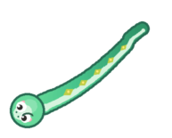
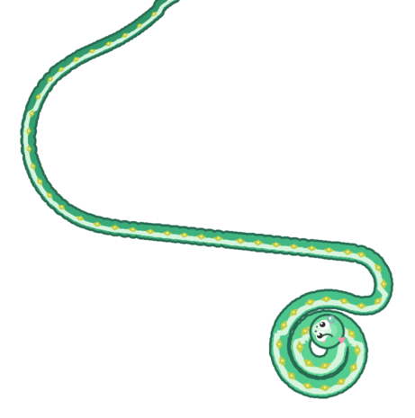
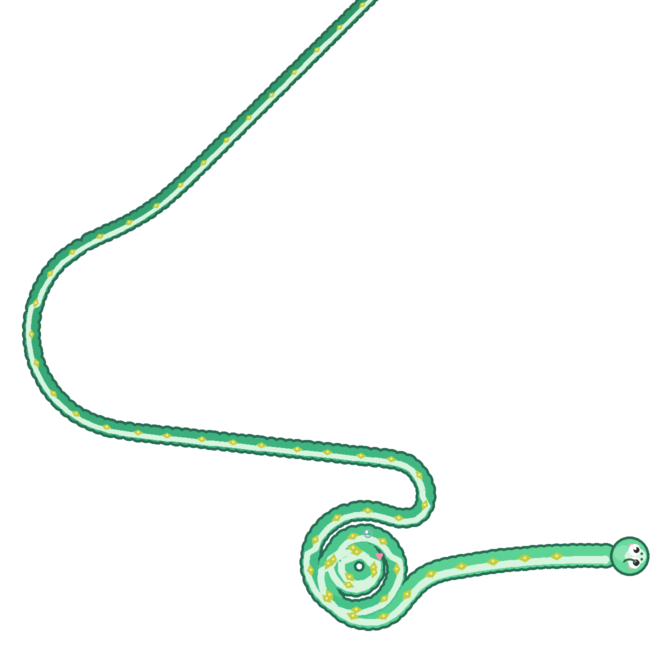
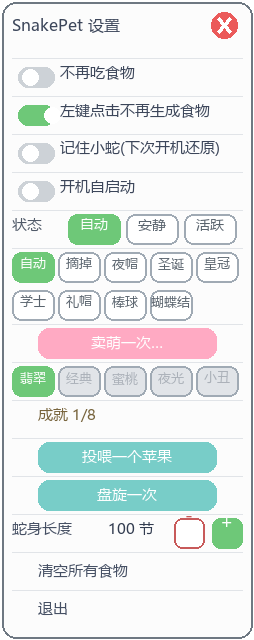
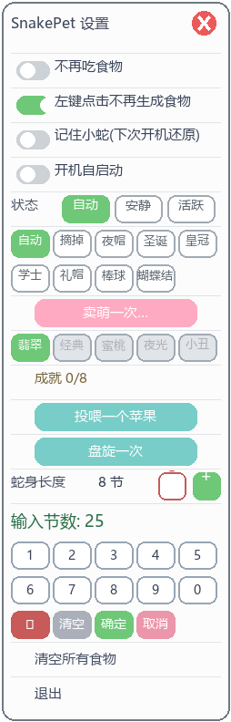

# SnakePet v5 🐍

**Windows 桌面宠物小蛇** —— 一条住在桌面最底层、会陪你上班摸鱼的贪吃蛇。

360° 自由游动 · 分层盘旋 · 帽子衣柜 · 皮肤养成 · 抚摸拎起 · 自动存档

| 游动 | 分层盘旋 | 100 节长蛇 |
|---|---|---|
|  |  |  |

纯 **Win32 分层窗口 + Pillow** 实现，无 tkinter / pygame / 游戏引擎依赖，单进程轻量运行，开箱即用。

---

## ✨ 它能做什么

- **住在桌面上**：小蛇沉底显示，打开任何软件都会盖住它，回到桌面就能看到；透明区域不挡鼠标点击。
- **自由游动**：360° 连续转向（v4 只会四方向"拐直角"），转弯半径 ~100px 的大弧线，路径经滑动平滑，游动丝滑无抖动。
- **会饿会吃**：在桌面空白处左键点一下，那里长出一颗苹果，小蛇自己摇摆着爬过去吃掉，身体变长、心情变好。
- **分层盘旋**：空闲时（或菜单里点「盘旋一次」）小蛇沿阿基米德螺线盘入 → 盘踞 → 盘出，身体绕成多层同心圈。
- **帽子衣柜**：夜帽 / 圣诞帽 / 皇冠 / 学士帽 / 礼帽 / 棒球帽 / 蝴蝶结共 7 顶，全部**随头朝向旋转**；`自动` 档在夜里(22:00–6:00)自动戴上睡帽。
- **心情与表情**：开心 / 平常 / 饿了 / 睡觉四种状态，眨眼、吐信、腮红、说话气泡、Z 字弹幕……
- **养成系统**：吃多了会消化回收、长大变身、短期猛吃会变圆润；5 套皮肤与 8 个成就靠投喂解锁；**重启电脑后小蛇还记得你**（位置 / 长度 / 皮肤 / 帽子 / 成就全部保留）。
- **自我修复**：窗口被长时间遮挡后自动重建画面，挂机数天也不怕"消失"。

## 🎮 交互指南

| 你做什么 | 小蛇的反应 |
|---|---|
| 桌面空白处 **左键点击** | 长出一颗苹果（打开软件时点击不生成，不会误触） |
| **按住蛇头** 0.3 秒不动 | 抚摸：爱心满天飞（冷却 2 秒） |
| **按住蛇头拖动** | 拎起小蛇搬到任何地方，松手放下（睡觉中会被拎醒） |
| **双击蛇身** | 跳跃 + 说话气泡 |
| **右键蛇身** | 打开设置菜单 |

## ⚙️ 右键菜单

| 分组 | 内容 |
|---|---|
| 开关 | 不再吃食物 / 左键点击不再生成食物 / **不再自然变短** / **记住小蛇(下次开机还原)** / 开机自启动 |
| 状态 | 自动（有食物才活跃）· 安静 · 活跃 |
| 帽子 | 自动 · 摘掉 · 7 顶帽子任选 |
| 皮肤 | 翡翠玉蛇(默认) · 经典绿(吃 10 颗解锁) · 蜜桃粉(30) · 夜光(60) · 小丑(100) |
| 趣味 | 卖萌一次 · 投喂一个苹果 · 盘旋一次 |
| 长度 | −/＋ 微调；**点击节数数字**弹出数字键盘直接输入（2~100 节） |
| 其他 | 成就进度 (n/8) · 清空所有食物 · 退出 |




## 🍜 养成机制

- 每颗苹果：体长 +20px，饱食度 +20；饱食度随时间缓慢下降。
- **消化**：饱食度低于 40 时，身体慢慢缩回当前阶段的基础长度，伴着消化泡泡。
- **成长**：累计进食 20 颗长大成蛇（体型 ×1.15），100 颗成为大蛇（×1.3），帽子也跟着变大。
- **胖瘦**：10 分钟内连续进食会变圆润，一段时间不吃就恢复身材。
- **成就 8 枚**：初来乍到 / 第一口 / 小吃货 / 干饭王 / 传奇 / 七日之约 / 转圈圈 / 摸头杀。
- **存档**：退出、每 60 秒、以及成就解锁等关键时刻自动保存；档案损坏自动备份重建；菜单里可一键关闭"记住小蛇"。

## 🚀 快速开始

1. 安装 [Python 3.10+](https://www.python.org/downloads/)（安装时勾选 *Add to PATH*）。
2. 克隆本仓库，**双击 `启动小蛇.bat`**（首次运行自动安装 Pillow）。
3. 完成，小蛇已经在桌面等你了。

```bat
启动小蛇.bat
```

### 命令行

```bat
python run_pet.py                        正常启动
python run_pet.py --selftest             自检（运动学断言 + 模块自检）
python run_pet.py --soak 300             300 秒无人值守浸泡测试，输出 JSON 报告
python run_pet.py --soak 300 --headless  无窗口模式（CI / 远程会话）
python run_pet.py --render-probe DIR     渲染代表性画面到目录，用于视觉验收
```

## 📁 项目结构

```
├── 启动小蛇.bat        双击启动（自动检查 Python / Pillow）
├── run_pet.py          启动入口
├── snake_pet/          源码包
│   ├── constants.py    全部数值与主题表（调参入口）
│   ├── config.py       用户配置 + 版本迁移链
│   ├── platform_win.py Win32 封装（分层窗口/钩子/互斥/注册表）
│   ├── sprites.py      贴图加载与配色提取
│   ├── snake.py        360° 运动学（转向器/闲逛/追食/盘旋计划）
│   ├── behavior.py     状态机（饱食度/心情/睡觉/盘旋触发）
│   ├── interact.py     互动状态机（抚摸/拎起，纯逻辑可单测）
│   ├── growth.py       养成数值（消化/阶段/胖瘦/成就/存档）
│   ├── hats.py         帽子衣柜（佩戴线锚定/兜底手绘）
│   ├── render.py       PIL 渲染管线（七层绘制 + 路径平滑）
│   ├── menu.py         右键菜单（网格布局/长度输入编辑器）
│   └── app.py          组装：窗口/钩子/主循环/看门狗
├── sprites/hats/       帽子贴图 + hats.json 锚点元数据
├── tests/              pytest 单测（64 例，全部离屏可跑）
├── reports/            各阶段验收证据（浸泡 JSON / 渲染探针 / 对照报告）
└── dist/delivery/      交付文档快照（使用说明 / CHANGELOG / 素材致谢）
```

## 🏗️ 技术实现要点

想改造或二开的话，这些是核心设计：

- **渲染管线**：每帧用 Pillow 把"蛇 + 食物 + 特效"画成整幅 RGBA，经 `UpdateLayeredWindow` 推上分层窗口，透明区天然点击穿透；**像素预算自适应超采样**（渲染像素数恒定 ≤ 预算，按实测帧耗时自动升降），小画布 2× 抗锯齿、大画布自动降档，帧率与细腻度自动平衡。
- **360° 运动学**：蛇头持有朝向角 θ，每帧经限速转向器逼近目标方向；闲逛 = 高斯漂移 + 趋势角重置 + 边界内推场 + 障碍扇形采样；身体沿轨迹按弧长采样，天然支持任意弯曲。
- **丝滑曲线**：转向死区（<3.4° 不转）+ 渲染路径滑窗平均，小碎弯被圆弧化；腹带/描线用带 `joint` 的连续笔画。
- **分层盘旋**：三阶段状态机输出"期望头位置"，头部以「导轨上的胡萝卜」方式追踪阿基米德螺线；圈距 = (R0−r_min)/圈数 ≥ 1.6×体宽，保证层层有缝。
- **互动状态机**：press/hold/drag 纯逻辑层（时间可注入、离屏可测），与撒食/菜单/双击等既有语义零冲突。
- **看门狗自愈**：周期性用 `WindowFromPoint` + 屏幕像素采样检测合成器冻结/遮挡，必要时重建窗口。
- **工程化**：v4 字节码反汇编仲裁重建，每阶段 Gate 有单测与证据落盘；测试全部离屏可跑、存档目录自动隔离。

## ❓ 常见问题

- **点蛇没反应？** 单按蛇身是防误触设计（无动作）；抚摸要按住**蛇头** 0.3 秒；跳跃改在双击。
- **小蛇被盖住了？** 这是设计（沉底显示），回到桌面即可看到；被遮挡太久它会自动重建画面。
- **想让它记住自己？** 菜单里「记住小蛇」保持开启（默认开）。
- **想换形象？** 菜单「皮肤」；帽子可把 128px 宽 PNG 放进 `sprites/hats/` 并按 `hats.json` 格式登记。
- **怎么彻底关掉？** 菜单「退出」；若开启过自启动，删除注册表 `HKCU\...\Run` 下的 `SnakePet` 键值。

## 📜 版本历史

见 [CHANGELOG.md](CHANGELOG.md)：v4 → v5 的全量升级记录，以及 v5.1.x 的体验反馈修复。

## 🙏 素材致谢

- Crown / Top hat / Billed cap / Graduation cap / Ribbon / Snake 3D：[Microsoft Fluent Emoji](https://github.com/microsoft/fluentui-emoji)（MIT License）
- Santa hat：[いらすとや](https://www.irasutoya.com/)
- v4 夜帽贴图来自原版 SnakePet。

完整署名见 [dist/delivery/素材致谢.md](dist/delivery/素材致谢.md)。

## 📄 许可

本项目源码随仓库交付，供学习与个人使用。
