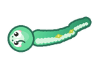

# SnakePet v5 —— 桌面宠物小蛇(360° 游动 · 分层盘旋 · 帽子衣柜 · 养成系统)

从桌宠贪吃蛇 **SnakePet v4** 全面升级而来的 Windows 桌面宠物,纯 Win32 分层窗口 + Pillow 渲染,无 tkinter/pygame 依赖。



## 快速开始

1. 安装 [Python 3.10+](https://www.python.org/downloads/)(勾选 *Add to PATH*)。
2. 双击 **`启动小蛇.bat`** —— 首次运行会自动安装 Pillow,随后小蛇出现在桌面。
3. 开心玩耍:

| 交互 | 效果 |
|---|---|
| 桌面左键点击 | 撒一颗苹果,小蛇会追过去吃掉并变长 |
| 按住蛇头 0.3s | 抚摸(爱心 + 开心,冷却 2s) |
| 按住蛇头拖动 | 拎起小蛇搬到任意位置,松手放下 |
| 双击蛇身 | 跳跃 + 说话气泡 |
| 右键蛇身 | 设置菜单(帽子/皮肤/成就/投喂/盘旋…) |

## v5 相对 v4 的升级

- **360° 自由游动**:告别四方向"拐直角",连续转向 + 边界内推场,游动丝滑自然。
- **分层盘旋**:空闲或菜单「盘旋一次」时,小蛇沿阿基米德螺线盘入 → 盘踞 → 盘出,身体形成多层同心圈。
- **全新形象**:以微软 Fluent 3D 蛇为基准重绘——大眼高光、吐信动画、背部菱形斑、锥形身体、腹带。
- **帽子衣柜**:7 顶帽子(夜帽/圣诞/皇冠/学士/礼帽/棒球/蝴蝶结)随朝向旋转,`auto` 档夜间自动戴夜帽。
- **互动增强**:投喂 / 抚摸 / 拎起拖动,与原交互零冲突。
- **养成系统**:消化回收体长、幼蛇→成蛇→大蛇三阶段成长、胖瘦体型、5 套皮肤按成就解锁、8 个成就、完整存档(退出/每 60s 自动保存,重启后小蛇还记得你)。

## 命令行

```
python run_pet.py                     正常启动
python -m snake_pet --selftest        自检(运动学断言 + 模块自检)
python -m snake_pet --soak 300        300 秒无人值守浸泡,输出 JSON 报告
python -m snake_pet --soak 300 --headless   无窗口模式
python -m snake_pet --render-probe DIR   渲染代表性画面到目录(视觉验收)
```

## 目录结构

```
├── 启动小蛇.bat        双击启动
├── run_pet.py          启动器入口
├── snake_pet/          源码包(constants/config/platform_win/sprites/snake/
│                       coil逻辑/fx/behavior/interact/growth/hats/render/menu/app)
├── sprites/            运行素材(hats/ 帽子衣柜 + hats.json)
├── tests/              pytest 单测(61 例)
├── reports/            各阶段 Gate 证据(自检/soak/渲染探针/对照报告)
└── dist/delivery/      交付物快照(使用说明/CHANGELOG/素材致谢)
```

## 数据与卸载

- 配置/存档写在与本目录同级(源码态),打包态写 `%APPDATA%\SnakePet`;可用环境变量 `SNAKEPET_HOME` 重定向。
- 卸载:删除本目录 + 注册表 `HKCU\...\Run` 中的 `SnakePet` 键值(若开启过自启动)。

## 许可与致谢

- 本项目源码随仓库交付。
- 帽子/形象参考素材来源与许可见 `dist/delivery/素材致谢.md`。
